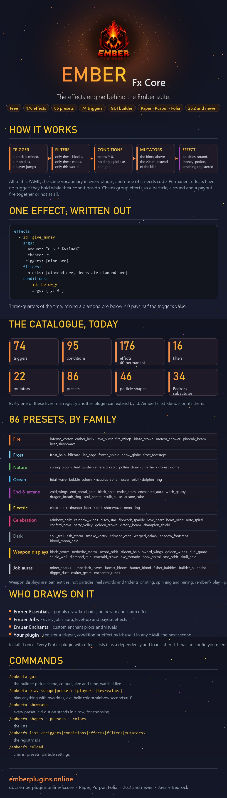

<h1 align="center">Ember Fx Core</h1>

The effects engine behind the Ember suite. Free.

Install it once; every Ember plugin with effects depends on it and loads after it. It has no configuration you need to touch.

## What it is

A **trigger** happens (a block is mined, a mob dies, a player jumps). **Filters** narrow it to the targets you care about. **Conditions** check the moment. **Mutators** reshape what the effect sees. Then the **effect** runs. All of it is YAML, the same vocabulary in every plugin, and none of it needs code.

| | count |
|---|:-:|
| Triggers | 74 |
| Conditions | 95 |
| Effects | 176 (40 permanent) |
| Filters | 16 |
| Mutators | 22 |
| Particle presets | 86, over 46 shapes |

Every one of these is in a registry another plugin can extend by id.

## Install

1. Download `EmberFxCore-1.0.0-release.jar` from [Releases](../../releases) and drop it in `plugins/`.
2. Install the plugins that use it (Ember Essentials portals, Ember Jobs, Ember Enchants). They declare it as a dependency.
3. `/emberfx gui` opens the builder; `/emberfx play <preset>` plays any of the 86 presets.

Runs on Paper, Purpur and Folia, 26.2 and newer, Java 25. On Folia every effect that touches a player runs on that player's region thread. Bedrock viewers get particle substitutes for the 34 particles Geyser cannot draw.

## Links

- The suite: https://emberplugins.online
- Documentation, including the full catalogue and the presets gallery: https://docs.emberplugins.online/fxcore
- Discord: https://discord.gg/survivalnetwork

## License

Proprietary, © 2023–2026 TheMeanOneDevelopments. Free to run on servers you operate; not for redistribution or modification.

## Media

`media/` holds the icon and the listing image. The listing image is regenerated whenever the catalogue changes.

